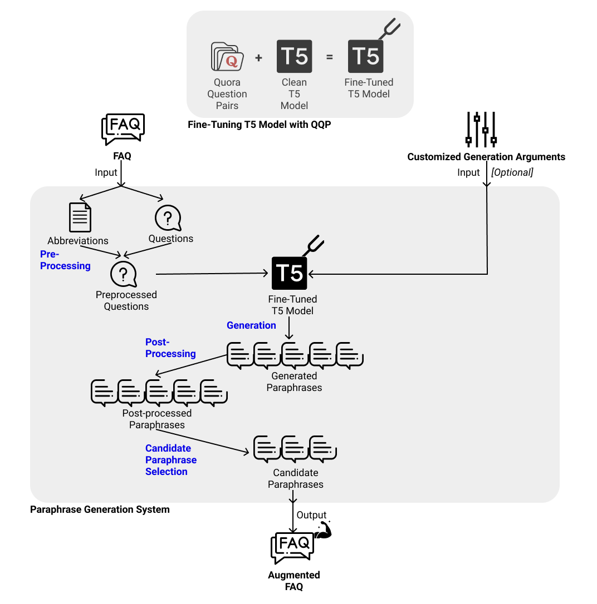
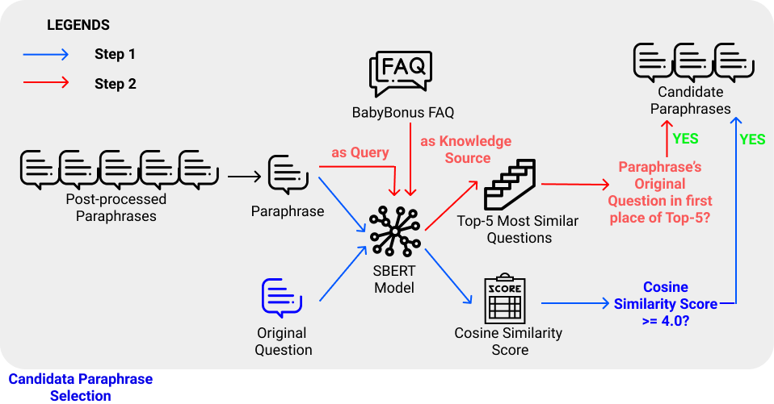
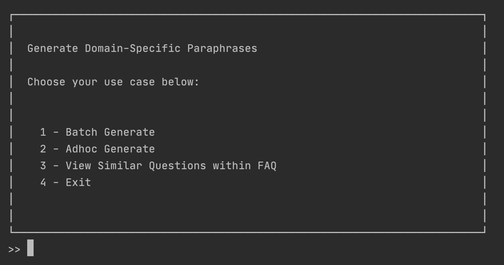

# Generate Domain-specific paraphrase of FAQ questions
### Table of Contents
1. [Introduction](#introduction)
2. [Installation](#installation)
3. [Storage](#storage)
4. [Use Cases](#use-cases)
5. [Disclaimer](#disclaimer)
6. [Author](#author)

## Introduction
This repository provides a complete system of generating paraphrases of the questions from a given FAQ dataset or an input question from a given FAQ dataset. The paraphrases are generated using a T5 model fine-tuned on Quora Question Pairs dataset, which is an off-domain labelled paraphrase dataset. Details on training the T5 model can be found in my another [repository](t5-training-paws-or-qqr).
The system also ensures that the generated paraphrases retains the domain-specific terms found in the original question, thereby ensuring that the paraphrases are domain-specific. 
The candidate selection process implemented in the system shortlists paraphrases that are semantically similar to their original question and preserves the class label (i.e. most semantically similar to the original question, compared to all other original questions of the FAQ). 

There are three main ways that the users can use this system, as demonstrated in ["Use Cases" section](#use-cases):
1. Batch generate paraphrases of all questions of a given FAQ dataset to obtain an augmented FAQ dataset.
2. Adhoc generate paraphrases of a given input question from a given FAQ dataset.
3. View all similar questions in a given FAQ dataset.

A detailed view of the system aforementioned can be viewed in the image below.


A detailed view of the candidate selection process can be viewed in the image below:

## Installation
### Step 1: Clone this repository (Navigate to your desired directory prior to cloning)
```powershell
git clone https://github.com/NgJingRui/generate_domain_specific_faq_paraphrase.git
cd generate_domain_specific_faq_paraphrase
```
### Step 2: Dependencies Installation
*Note: Dependencies Installation differs between macOS and Windows user.*

**Pre-requisites:**
1. Python v3.7.7 (I used this version throughout my implementation and testing)
2. virtualenv

Launch your command line to perform the following installations:

**For macOS users:**

1. Set up virtual environment using virtualenv
    ``` powershell
    virtualenv .env
    source .env/bin/activate
    python -m pip install --upgrade pip
    ```
2. Install dependencies
    ``` powershell
    pip install torch==1.7.0
    pip install -r requirements.txt
    python load_punkt.py
    ```

**For Windows users:**
1. Set up virtual environment using virtualenv
    ``` powershell
    virtualenv .env
    .\.env\Scripts\activate
    python -m pip install --upgrade pip
    ```
2. Install dependencies
    ```
    # with cuda
    pip install torch===1.7.0 torchvision===0.8.1 torchaudio===0.7.0 -f https://download.pytorch.org/whl/torch_stable.html
    ## to install pytorch without cuda, run the pip install below instead
    # pip install torch==1.7.0+cpu torchvision==0.8.1+cpu torchaudio===0.7.0 -f https://download.pytorch.org/whl/torch_stable.html
    pip install -r requirments.txt
    python .\load_punkt.py
    ```
## Storage
You are advised to store your input FAQ datasets in the format of .csv with no headers and in the ./faq folder.
e.g. "./faq/babyBonus.csv" in this repository

My trained T5 model will be automatically downloaded to ./models/t5_qqp from my Google Drive when you initialise the T5Generator with `model_path = "./models/t5_qqp/"`
## Use Cases

Launch the GUI by running `python app.py` in your terminal and choose to run one of the three use cases described below.
You will see this GUI


### Use Case 1: Batch generate paraphrases of all questions of a given FAQ dataset to obtain an augmented FAQ dataset.
If you are using the GUI, you will be asked to provide the following arguments:
1. "Name of the FAQ file or its relative path from current working directory: ": input file or path
    * Example input: (*Note: Without quotation marks*)
        * babyBonus.csv 
        * ./data/baby2.csv 
    * If input file given, then input file assumed to be stored in ./faq folder
    * If input path given, then it should include the input file name e.g. ./data/baby2.csv
2. "Name of output file or its relative path from .outputs folder: ": Output file or path
    * Example input:
        * babyBonus.csv
        * my_desired_folder_in_outputs_folder/babyBonus.csv

3. "# of paraphrase to generate for each question: ": 
    * Example input:
        * 10
4. "# of paraphrase to generate for each question: ":
    * Example input:
        * 5
        
If you are **NOT** using the GUI, you can call the script directly, by passing in the arguments!
* Example 1:
  ```
  python batch_generate_app -i babyBonus.csv -o babyBonus.csv --n_gen 10 --k_top 5
  ```
* Example 2:
  ```
  python batch_generate_app -i babyBonus.csv -o my_desired_folder_in_outputs_folder/babyBonus.csv --n_gen 10 --k_top 5
  ```
### Use Case 2: Adhoc generate paraphrases of a given input question from a given FAQ dataset.
If you are using the GUI, answer the questions accordingly, which are identical to those ask in Use Case 1.

If you are not using the GUI, you can update `input_question`, `generate_n_paraphrases` and `keep_top_k_paraphrases`, 
followed by running `python adhoc_generate_app_fixed.py`

### Use Case 3: View all similar questions in a given FAQ dataset.
If you are using the GUI, provide the name of your FAQ file that you stored in the ./faq folder.

If you are not using the GUI, you can update the `input_file` variable in find_all_similar_questions_within_faq.py 
and run `python find_all_similar_questions_within_faq.py` 
## Disclaimer
I have tested and ran all the source code included in this repository using a 13" Macbook Pro (2020) running on macOS v11.2.1 with a Python version of 3.7.7.


As I do not have a working Windows PC in my possession, I have performed limited testing on a Windows distribution. If there are any errors, it is likely to be specific to the Windows distribution, as some discrepancies exist between MacOS and Windows such as the path string. Please do feel free to raise any issues, and I will provide my solutions promptly.

## Author
Ng Jing Rui for AY2020/2021 FYP


Submitted in Partial Fulfilment of the Requirements for the Degree of Bachelor of Computer Science and Engineering of the Nanyang Technological University

Under the guidance of Assoc. Prof Chng Eng Siong and his team that includes Damien Cheng, Thi Ly and Zin Tun